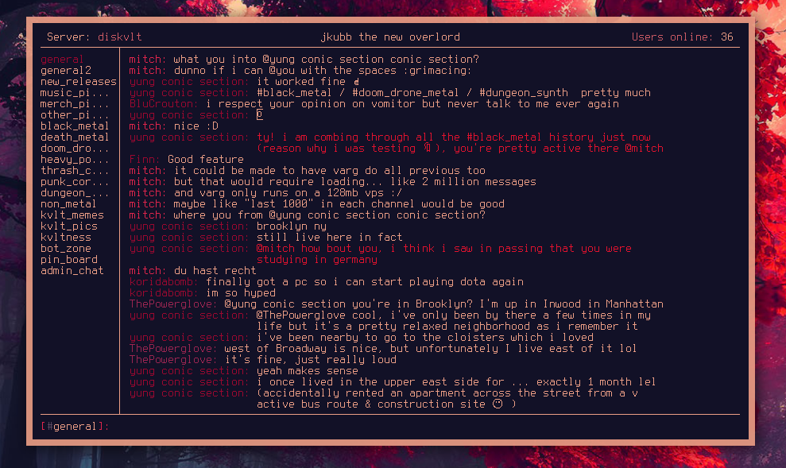
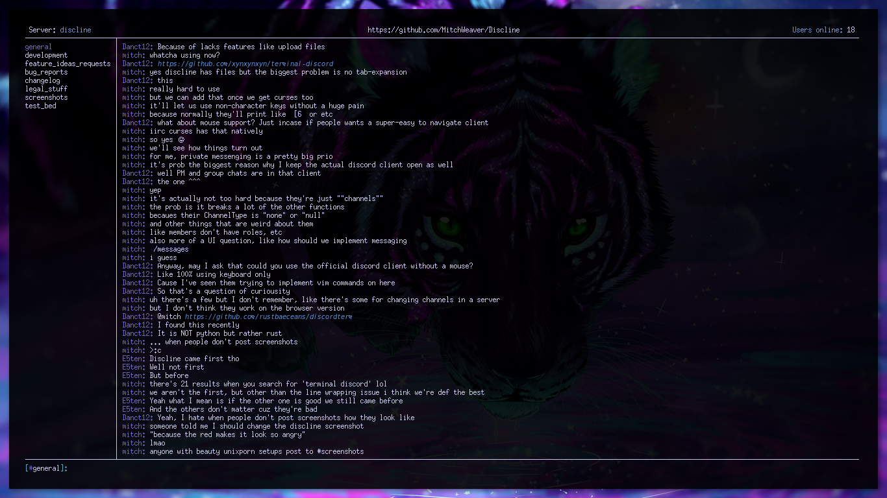
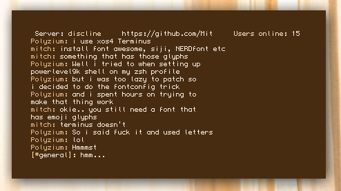

#  Discline
------------------------------



__**Warning**__: Currently Linux/BSD/Mac only, it may be a while before support for Windows comes back.

**NOTE**: A total rewrite of Discline in curses/ncurses is underway!

## How to use:
-------------------------

1. Install the dependencies:

    `sudo pip3 install asyncio discord blessings pyyaml`

2. Clone the repo

    `git clone https://github.com/MitchWeaver/Discline`

3. Find your discord "token"

    * Go to http://discordapp.com/channels/@me

    * Open your browser's developer console. (Normally `F12` or `CTRL-SHIFT-I`)

    * Look for "storage" or "local storage", then find the discord url.

    * Clicking this will show you a list of variables. Look for a line that looks like:

        `"token = 322332r093fwaf032f90323f32f903f23wfa"`

    If you're having troubles, google around, there's a few guides on the net.

    If all else fails, join the dev discord and we'll be glad to help!

4. Run `python3 Discline.py --store-token` to store your token

5. Run `python3 Discline.py --copy-skeleton` to get a template config

6. Edit `~/.config/Discline/config` to your choosing.

7. Launch with python3

    `python3 Discline.py`

    *(alternatively if you have python3.6 you can simply use `./Discline.py`)*


### Current Features
--------------------------

* /channel to switch channel
* /server to switch server
* /nick to change nickname (per server)
* typing without a leading prefix will submit to current chat
* "<USER> is typing..." support
* private channels
* colored output, with user definable colors and custom roles
* Channel logs update when users edit messages
* /channels, /servers, /users to view information
* /game to update the "Now playing: " status
* use /help to see more commands
* unicode emoji displayal support
* sending emojis in messages (unicode *and* custom)
* File uploading via path (ex: /file /path/to/file)
* italic, bold, and underline font support
* inline \`code\` and \`\`\`code\`\`\` block support
* URL detection, highlighting in blue + italics
* automatic updating, fetching the latest master branch's commit
* channel logs blink red upon unread messages
* line scrolling
* discord "Nitro" emojis
* Externalized configs via YAML ~/.config/Discline/config
* @member expansion/mentions
* /status to change online presence

### Planned Features
---------------------------

* emoji reactions
* comment editing and deletion
* private messaging
* message searching

## Dependencies
------------------------

* git (if you want automatic updates)
* [Python 3.5+](https://www.python.org/downloads/)
* [discord.py](https://github.com/Rapptz/discord.py)
* [blessings.py](https://pypi.python.org/pypi/blessings/)
* [PyYAML](https://pypi.python.org/pypi/PyYAML/)
* asyncio

**To install dependencies**:

1. Download Python 3.5/3.6 from the link above
2. Install `pip3`, normally called `python3-pip` in package managers
3. Download the dependencies using pip with the following command:

    `sudo pip3 install asyncio discord blessings pyyaml`


### Color Customization
------------------------

Almost all aspects of the client can be colored to
the user's wishes. You can set these colors from within `~/.config/Discline/config`

Note: These assume that you're using the standard terminal colors. If you
have colors already defined in your ~/.Xresources or similar, this will 
be very confusing.

## Launching
------------------------
Discline uses git for automatic updates, so you must be within the Discline
directory upon starting. Manually you can launch via `python3.6 ./Discline.py`, 
however it is advised to create a helper script to do this for you.

An example script is in the /res/scripts folder, 
edit it to suit your system and tastes.

### A Note On Emojis
-------------------------

Currently *most* of the standard unicode emojis
are displaying. Note your terminal must be able
to render these symbols *and* you must be using a font
set that contains them. Because some of the emojis
that discord uses are non-standard, they may not
display properly. Here is an example of a random
few.


Custom emojis however, are displayed as :emoji_name:

### Note On Font Support
-------------------------

Like emojis, not all terminals and fonts support
italic/bold/underline and 'background' colors, (which are used for \`code\`).
If these features aren't working for you, odds are you are not using a
supported terminal/font. Experiment with different setups to see what works.


*Letting me know what setups __don't__ work helps a lot!*

### Dude this is awesome! How can I support the project?
--------------------------------------------------------

Star it! 🌟

It helps to get it higher in GitHub's search results as well as
making me feel good inside. ;)

If you'd like to contribute, pull requests are __*always*__ welcome!

If you would like to get more info on what could be done or to discuss the
project in general, come join the discord server at: https://discord.gg/rBGQMTk

### FAQ
-------------------------

> Yet another discord cli?

I didn't like any of the implementations I found around github. Too buggy.
Too bloated. Bad UI. No customization. Some, after discord updates,
no longer functioning at all.

> Why use a token and not email/password?

Discord's API __does__ allow for email/pass login, but if you were to have
2FA, (2 factor authentication), enabled on your account, Discord would
interpret this as a malicious attack against your account and disable it.

So, because *"Nobody reads the readme"*, I have disabled this.

> How should I submit a GitHub issue?

Try to include this format:

```
OS: Linux/Debian
Terminal: urxvt
Font: source code pro
Python Version: 3.6
How to reproduce: xxxxxx
```

> It says my python is out of date even though I have 3.5+ installed?

Probably because you have multiple versions installed. Try running with
`python3.5` or `python3.6` rather than just "python3"

> I'm getting weird encoding errors on startup

You probably don't have UTF-8 set. If you're using Linux,
look up how to do this according to your distro.

If you're on BSD, add this to your /etc/profile:

```
export LC_CTYPE=en_US.UTF-8
export LESSCHARSET=utf-8
```

and make sure it gets sourced upon opening your terminal.

### Misc Screenshots
--------------------------




It can even be configured to hide most elements of the UI in the config:



### Known Bugs
--------------------------

> Line wrapping sometimes doesn't work

This happens if there is too much formatting / coloring being done to the
message that contains that line. I'm looking for a work around.

> When I type many lines before hitting send, the UI sometimes bugs out
and/or the separators encroach upon different sections

Known. Looking for a work around.

> My bug isn't listed here, how can I voice my problem?

If you have a specific issue that isn't listed here or in the
wiki, post a github issue with a detailed explanation and I can
try to get it fixed. Join the discord if you want live help.

### Token Warning
-------------------------------
Do *NOT* share your token with anybody, if someone else gets ahold
of your token, they may control your account. If you are someone
who keeps their ~/.config on github, **add your token to your .gitignore**.
Otherwise it will become public.


### License
-------------------------------

Licensed under GNU-GPLv3


### Legal Disclaimer
--------------------------------

Discord hasn't put out any official statement on whether using their
API for 3rd party clients is allowed or not. They *have* said that using
their API to make "self-bots" is against their ToS. By self-bots, it is
my understanding they mean automating non-bot accounts as bots.
My code has no automated functions, or any on_events that provide features
not included in the official client.

As far as I know, nobody has been banned for using things like this before,
but Discord might one day change their mind. With this said, I take **no**
responsibility if this gets you banned.
